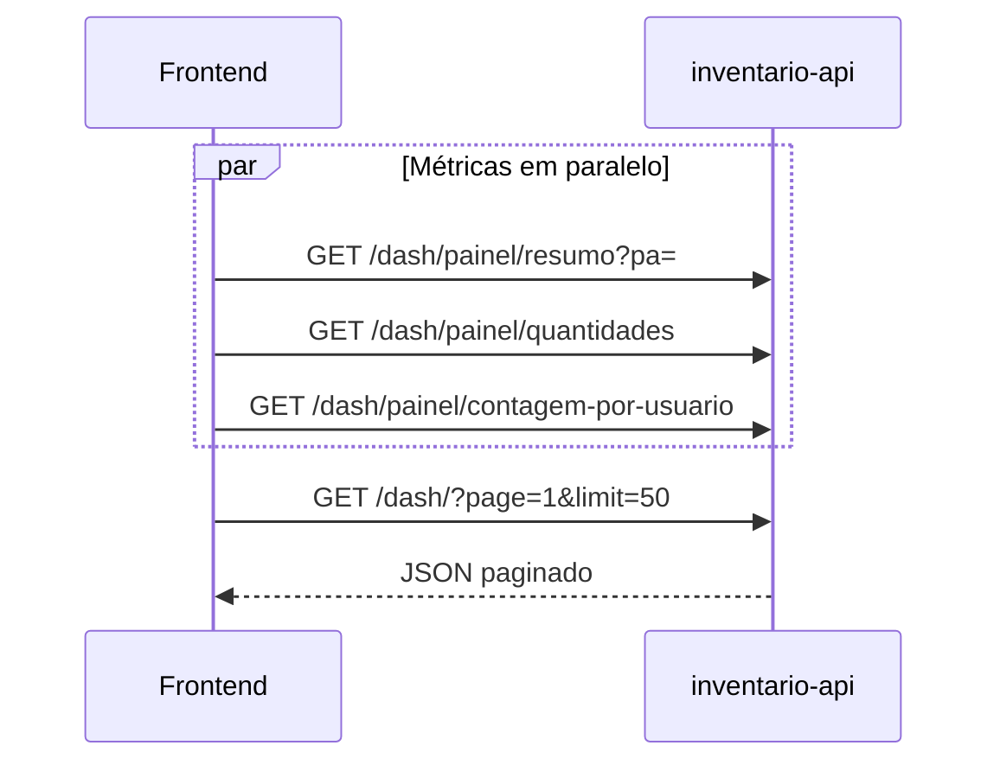
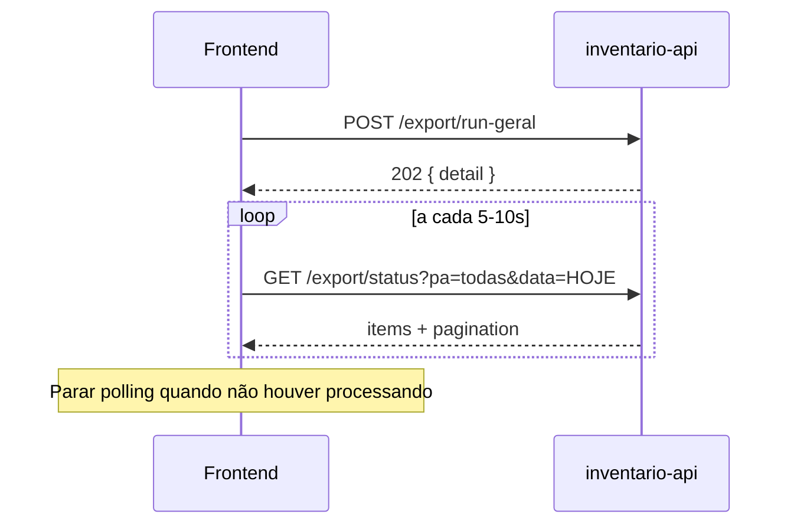

# Especificação Frontend — Painel (Dash) e Exportações

Documento de referência para integração do front-end com a **inventario-api**.

**Versão da API:** `0.2.0`  
**Última atualização:** 2026-06-30  
**OpenAPI (Swagger):** `{BASE_URL}/inventario-api/docs`

---

## 1. Informações gerais

### 1.1 URL base

| Ambiente | Exemplo |
| -------- | ------- |
| Prefixo da aplicação | `/inventario-api` |
| API v1 | `/inventario-api/api/v1` |
| Health check | `GET /inventario-api/` → `{ "msg": "API está no ar!" }` |

Substitua o host conforme o deploy (ex.: `https://servidor/inventario-api/api/v1`).

### 1.2 Autenticação

Os endpoints de **Dash** e **Export** documentados aqui **não exigem** header de autenticação no código atual. Se o gateway/IIS aplicar autenticação na frente, alinhar com o time de infra.

### 1.3 Convenções globais

| Tópico | Regra |
| ------ | ----- |
| **Fuso horário** | Todas as datas de negócio (bipagem, agendamento, filtro `data` do export) usam **`America/Sao_Paulo` (UTC-3)** |
| **Formato de data (query)** | `YYYY-MM-DD` (ISO 8601, apenas data) |
| **Formato de hora (schedule)** | `HH:MM` (24h), ex.: `10:00`, `18:00` |
| **Paginação** | `page` é **1-based** (primeira página = `1`) |
| **Content-Type** | `application/json` em POST com body |
| **Compressão** | API suporta gzip nas respostas (recomendado aceitar `Accept-Encoding: gzip`) |
| **Cache (painel)** | Respostas do dash podem vir do Redis (TTL ~2–5 min). Após mutações no inventário, dados podem demorar alguns minutos para refletir |

### 1.4 Códigos HTTP comuns

| Código | Quando |
| ------ | ------ |
| `200` | Sucesso (GET) |
| `202` | Aceito — processamento em background (POST export) |
| `403` | Recurso bloqueado em produção (ex.: `incluir_seriais=true`) |
| `404` | Lote, serial ou export não encontrado |
| `422` | Validação de parâmetros (formato de data/hora inválido) |
| `500` | Erro interno (mensagem genérica; detalhe só em log) |

---

## 2. Módulo Dashboard (`/dash`)

Tag OpenAPI: **Dashboard Painel**

### 2.1 Visão de telas sugeridas

```text
┌─────────────────────────────────────────────────────────────┐
│  PAINEL PRINCIPAL                                           │
│  ├─ Cards: GET /dash/painel/resumo                          │
│  ├─ Gráfico/tabela PA×status: GET /dash/painel/quantidades  │
│  ├─ Ranking usuários: GET /dash/painel/contagem-por-usuario │
│  └─ Tabela lotes paginada: GET /dash/                       │
│       └─ Clique na linha → GET /dash/{lote_id}              │
├─────────────────────────────────────────────────────────────┤
│  BUSCA SERIAL (opcional)                                      │
│  └─ GET /dash/info-serial/{serial}                          │
└─────────────────────────────────────────────────────────────┘
```

---

### 2.2 `GET /dash/` — Lista paginada de lotes

Lista **resumida** de lotes (sem caixas/bipagens). Otimizada para alto volume.

**Query params**

| Param | Tipo | Obrigatório | Default | Descrição |
| ----- | ---- | ----------- | ------- | --------- |
| `page` | int | não | `1` | Página (≥ 1) |
| `limit` | int | não | `50` | Itens por página (1–100) |
| `pa` | string | não | — | Filtrar por torre/PA (`group_user`) |
| `status` | string | não | — | Filtrar por status do lote |

**Resposta `200`**

```json
{
  "items": [
    {
      "id": 123,
      "status": "aberto",
      "group_user": "PA-SP",
      "username": "operador01"
    }
  ],
  "page": 1,
  "limit": 50,
  "total": 1200,
  "total_pages": 24
}
```

**Campos `items[]`**

| Campo | Tipo | Descrição |
| ----- | ---- | --------- |
| `id` | int | ID do lote — usar em `GET /dash/{lote_id}` |
| `status` | string | Status do lote (ex.: `aberto`, `fechado`, `invalidado`) |
| `group_user` | string \| null | Torre/PA do lote |
| `username` | string \| null | Usuário criador do lote |

**UI**

- Tabela com paginação (`page`, `total_pages`, `total`)
- Filtros laterais/superiores: PA e status
- Ao clicar em um lote → tela de detalhe

---

### 2.3 `GET /dash/{lote_id}` — Detalhe do lote

Retorna lote completo com caixas e bipagens.

**Path params**

| Param | Tipo | Descrição |
| ----- | ---- | --------- |
| `lote_id` | int | ID do lote |

**Resposta `200`**

```json
{
  "id": 123,
  "status": "aberto",
  "group_user": "PA-SP",
  "username": "operador01",
  "caixas": [
    {
      "id": 456,
      "nr_caixa": "001",
      "identificador": "CX-001",
      "descricao": "Caixa principal",
      "status": "aberto",
      "bipagem": [
        {
          "id": 789,
          "nrserie": "SN123456",
          "unidade": 1,
          "modelo": "MODELO-X",
          "patrimonio": null,
          "observacao": "",
          "comentarios": null,
          "mensagem_ferramenta_inv": "OK"
        }
      ]
    }
  ]
}
```

**Erros**

| Código | `detail` |
| ------ | -------- |
| `404` | `Lote não encontrado.` |
| `500` | `Erro ao consultar detalhe do lote.` |

**UI**

- Cabeçalho: status, PA, usuário
- Accordion/lista por caixa
- Dentro de cada caixa: tabela de seriais bipados

---

### 2.4 `GET /dash/info-serial/{serial}` — Consulta por serial

Busca na base importada pelo serial do fabricante.

**Path params**

| Param | Tipo |
| ----- | ---- |
| `serial` | string |

**Resposta `200`**

```json
{
  "serial": "SN123456",
  "modelo": "MODELO-X",
  "mensagem_ferramenta_inv": "Mensagem da ferramenta"
}
```

**Erros**

| Código | `detail` |
| ------ | -------- |
| `404` | `Serial não encontrado` |

---

### 2.5 `GET /dash/painel/resumo` — KPIs agregados

**Query params**

| Param | Tipo | Descrição |
| ----- | ---- | --------- |
| `pa` | string | Opcional — filtra métricas por torre |

**Resposta `200`**

```json
{
  "total_torres": 7,
  "total_lotes": 1500,
  "total_seriais": 2500000,
  "pct_fechados": 45.50,
  "pct_abertos": 50.25,
  "pct_invalidados": 4.25
}
```

**UI**

- Cards ou donut chart com percentuais
- Filtro global por PA (recarrega resumo + quantidades)

---

### 2.6 `GET /dash/painel/quantidades` — Lotes por PA e status

**Resposta `200`** — array:

```json
[
  {
    "PA": "PA-SP",
    "status_lote": "aberto",
    "qtd": 42
  },
  {
    "PA": "PA-SP",
    "status_lote": "fechado",
    "qtd": 100
  }
]
```

**UI**

- Gráfico de barras empilhadas ou heatmap PA × status
- `status_lote` pode ser `null` em alguns registros — tratar como “Sem status”

---

### 2.7 `GET /dash/painel/contagem-por-usuario` — Produtividade

**Query params**

| Param | Tipo | Default | Descrição |
| ----- | ---- | ------- | --------- |
| `incluir_seriais` | bool | `false` | Se `true`, retorna lista de seriais por usuário |

**Resposta `200`** (padrão — só totais)

```json
[
  {
    "username": "operador01",
    "total_seriais": 1523,
    "seriais_bipados": []
  }
]
```

Com `incluir_seriais=true` (somente se habilitado no servidor):

```json
{
  "username": "operador01",
  "total_seriais": 3,
  "seriais_bipados": ["SN001", "SN002", "SN003"]
}
```

**Erros**

| Código | Quando |
| ------ | ------ |
| `403` | `incluir_seriais=true` em produção (`CONTAGEM_INCLUIR_SERIAIS_ENABLED=false`) |

**UI**

- Tabela ranqueada por `total_seriais`
- **Não** usar `incluir_seriais=true` em produção — payload muito grande

---

## 3. Módulo Exportações (`/export`)

Tag OpenAPI: **Export CSV**

### 3.1 Conceitos de negócio

| Conceito | Descrição |
| -------- | --------- |
| **Export geral** | Um CSV com bipagens de **todas as PAs** agregadas |
| **Export por PA** | Um CSV por torre/PA |
| **Dia de bipagem** | Filtro pela data em que o serial foi bipado (`criado_em` na view), não pela data de geração do arquivo |
| **Agendamento automático** | Backend gera **somente o CSV geral do dia atual** às **10:00, 13:00 e 18:00** (horário de Brasília) |
| **Arquivo** | `.csv.gz` (gzip) — usuário deve descompactar antes de abrir no Excel |
| **Particionamento** | Se passar de ~1.048.575 linhas, gera vários arquivos (`parte01_de_NN`, `parte02_de_NN`...) |
| **Job** | Cada arquivo gera um registro rastreável em `/export/status` |

### 3.2 Nomenclatura de arquivos

| Tipo | Padrão do nome |
| ---- | -------------- |
| Geral (1 parte) | `base_importada_2026-06-30_todas_as_pas.csv.gz` |
| Por PA | `base_importada_2026-06-30_PA-SP.csv.gz` |
| Particionado | `base_importada_2026-06-30_PA-SP_parte01_de_03.csv.gz` |

No banco, export geral grava `pa = "todas"`.

### 3.3 Colunas do CSV (referência para tooltip/ajuda)

Separador: `|` (pipe)

```text
PA | Lote | Serial | Modelo | Status | Data | Obs | Acao | Status Lote | Usuário Bipagem
```

- `Data`: formato `YYYY-MM-DD HH:MM:SS` em fuso de São Paulo
- `Acao`: campo `mensagem_ferramenta_inv` da bipagem

### 3.4 Status do job de export

| `status` | Significado | Ação no front |
| -------- | ----------- | ------------- |
| `processando` | Gerando CSV e/ou fazendo upload | Spinner / polling |
| `concluido` | Upload OK — `link` disponível | Botão download |
| `erro` | Falha (detalhe interno em log) | Mensagem + retry manual |

---

### 3.5 Visão de telas sugeridas

```text
┌─────────────────────────────────────────────────────────────┐
│  EXPORTAÇÕES                                                  │
│  ├─ Banner agendamento: GET /export/schedule                 │
│  ├─ Botões:                                                   │
│  │    [Gerar geral hoje]  → POST /export/run-geral           │
│  │    [Gerar tudo (geral+PA)] → POST /export/run-all         │
│  ├─ Filtros: PA, data                                        │
│  └─ Tabela paginada: GET /export/status                      │
│       └─ link → abrir URL Firebase (nova aba)                │
└─────────────────────────────────────────────────────────────┘
```

---

### 3.6 `GET /export/status` — Lista de exports

**Query params**

| Param | Tipo | Default | Descrição |
| ----- | ---- | ------- | --------- |
| `pa` | string | — | Filtrar por PA. Use **`todas`** para export geral |
| `data` | date | — | Dia da **bipagem** (presente no nome do arquivo), `YYYY-MM-DD` |
| `page` | int | `1` | Página (≥ 1) |
| `size` | int | `50` | Itens por página (1–200) |

**Resposta `200`**

```json
{
  "items": [
    {
      "pa": "todas",
      "data": "2026-06-30T15:51:01.560171-03:00",
      "status": "concluido",
      "link": "https://storage.googleapis.com/.../arquivo.csv.gz"
    }
  ],
  "pagination": {
    "page": 1,
    "size": 50,
    "total": 12,
    "total_pages": 1,
    "has_next": false,
    "has_previous": false,
    "start": 1,
    "end": 12
  }
}
```

**Campos `items[]`**

| Campo | Tipo | Descrição |
| ----- | ---- | --------- |
| `pa` | string \| null | `"todas"` = geral; caso contrário nome da PA |
| `data` | datetime \| null | Timestamp de criação do job (não confundir com filtro `data`) |
| `status` | string | `processando` \| `concluido` \| `erro` |
| `link` | string \| null | URL pública do Firebase quando `concluido` |

**Importante para o front**

- Filtro `?data=2026-06-30` usa a **data no nome do arquivo** (dia bipado), não `items[].data`
- Para “exports de hoje” na prática: `GET /export/status?data={hoje_SP}&pa=todas`
- Implementar **polling** (ex.: a cada 5–10s) enquanto houver itens com `status=processando` após disparo manual

---

### 3.7 `GET /export/schedule` — Estado do agendamento

Somente leitura. Mostra quando o próximo export automático (geral) vai rodar.

**Resposta `200`**

```json
{
  "enabled": true,
  "horarios": ["10:00", "13:00", "18:00"],
  "estimativa_segundos": 120.5,
  "estimativa_origem": "historico",
  "buffer_segundos": 120,
  "proximo_alvo": "2026-06-30T18:00:00-03:00",
  "inicio_estimado": "2026-06-30T17:57:59.664438-03:00",
  "ultima_execucao": "2026-06-30T13:00:05.123456-03:00",
  "ultima_duracao_segundos": 95.2
}
```

| Campo | Uso na UI |
| ----- | --------- |
| `enabled` | Badge “Agendamento ativo/inativo” |
| `horarios` | Lista fixa 10h / 13h / 18h (ou configurada) |
| `proximo_alvo` | “Próximo export automático às …” |
| `inicio_estimado` | Opcional — “Geração começa por volta de …” |
| `ultima_execucao` | “Último export automático: …” |
| `estimativa_origem` | `historico` ou `padrao` — informativo |

**Fuso:** todos os datetimes vêm com offset `-03:00`.

---

### 3.8 `POST /export/schedule` — Configurar agendamento

> Tela administrativa — normalmente restrita a perfil admin.

**Body**

```json
{
  "enabled": true,
  "horarios": ["10:00", "13:00", "18:00"]
}
```

| Campo | Tipo | Regras |
| ----- | ---- | ------ |
| `enabled` | bool | Liga/desliga agendamento |
| `horarios` | string[] | Formato `HH:MM`, mínimo 1 item, sem duplicatas; API ordena |

**Resposta `200`:** mesmo schema de `GET /export/schedule`.

**Erros `422`:** horário inválido (ex.: `25:00`).

---

### 3.9 `POST /export/run-geral` — Disparo manual (só geral)

Equivalente ao que o agendador faz automaticamente.

**Query params**

| Param | Tipo | Default |
| ----- | ---- | ------- |
| `data` | date (`YYYY-MM-DD`) | hoje (SP) |

**Resposta `202`**

```json
{
  "detail": "Export geral do dia iniciado. Acompanhe em /export/status."
}
```

**Resposta quando já há lote rodando** (ainda `202`, mas mensagem diferente):

```json
{
  "detail": "Já existe uma geração em andamento. Aguarde concluir antes de disparar novamente."
}
```

**Fluxo UI**

1. Confirmar ação (“Gerar CSV geral de hoje?”)
2. POST `/export/run-geral` (opcional `?data=YYYY-MM-DD`)
3. Toast de sucesso
4. Redirecionar ou atualizar lista `/export/status?pa=todas&data=...`
5. Polling até `concluido` ou `erro`

---

### 3.10 `POST /export/run-all` — Disparo manual (geral + cada PA)

Gera **1 CSV geral + 1 CSV por PA** com bipagem do dia.

**Query params:** iguais ao `run-geral`.

**Resposta `202`**

```json
{
  "detail": "Geração em lote iniciada. Acompanhe em /export/status."
}
```

**UI**

- Avisar que pode demorar (vários arquivos)
- Desabilitar botão enquanto `detail` indicar geração em andamento
- Listar todos os jobs na tabela de status (sem filtrar só `todas`)

---

## 4. Fluxos integrados (sequência)

### 4.1 Carregar painel principal



### 4.2 Export geral manual + acompanhamento



### 4.3 Export automático (sem ação do usuário)

O backend dispara sozinho às 10h, 13h e 18h (SP). O front só precisa:

1. Exibir `GET /export/schedule` (próximo alvo / última execução)
2. Atualizar `GET /export/status` periodicamente ou ao abrir a tela

---

## 5. Tipos TypeScript (sugestão)

```typescript
// --- Dash ---
export interface LotePainelResumo {
  id: number;
  status: string;
  group_user: string | null;
  username: string | null;
}

export interface LotesPaginadosResponse {
  items: LotePainelResumo[];
  page: number;
  limit: number;
  total: number;
  total_pages: number;
}

export interface ResumoPainel {
  total_torres: number;
  total_lotes: number;
  total_seriais: number;
  pct_fechados: number;
  pct_abertos: number;
  pct_invalidados: number;
}

export interface QuantitativoStatus {
  PA: string;
  status_lote: string | null;
  qtd: number;
}

export interface ContagemPorUsuario {
  username: string;
  total_seriais: number;
  seriais_bipados: string[];
}

// --- Export ---
export type ExportJobStatus = "processando" | "concluido" | "erro";

export interface ExportStatusItem {
  pa: string | null;
  data: string | null; // ISO datetime
  status: ExportJobStatus;
  link: string | null;
}

export interface PageInfo {
  page: number;
  size: number;
  total: number;
  total_pages: number;
  has_next: boolean;
  has_previous: boolean;
  start: number;
  end: number;
}

export interface ExportStatusPage {
  items: ExportStatusItem[];
  pagination: PageInfo;
}

export interface ScheduleConfig {
  enabled: boolean;
  horarios: string[];
  estimativa_segundos: number;
  estimativa_origem: "historico" | "padrao";
  buffer_segundos: number;
  proximo_alvo: string | null;
  inicio_estimado: string | null;
  ultima_execucao: string | null;
  ultima_duracao_segundos: number | null;
}

export interface ApiMessage {
  detail: string;
}
```

---

## 6. Helpers recomendados (front)

### 6.1 Data “hoje” em São Paulo

```typescript
function hojeSaoPauloISO(): string {
  return new Intl.DateTimeFormat("en-CA", {
    timeZone: "America/Sao_Paulo",
    year: "numeric",
    month: "2-digit",
    day: "2-digit",
  }).format(new Date()); // "YYYY-MM-DD"
}
```

### 6.2 Formatar datetime da API

Respostas usam ISO 8601 com offset `-03:00`. Exibir com:

```typescript
new Intl.DateTimeFormat("pt-BR", {
  timeZone: "America/Sao_Paulo",
  dateStyle: "short",
  timeStyle: "short",
}).format(new Date(isoString));
```

### 6.3 Polling de export

```typescript
async function aguardarExports(
  fetchStatus: () => Promise<ExportStatusPage>,
  intervalMs = 8000,
  timeoutMs = 600_000
): Promise<void> {
  const deadline = Date.now() + timeoutMs;
  while (Date.now() < deadline) {
    const page = await fetchStatus();
    const pendente = page.items.some((i) => i.status === "processando");
    if (!pendente) return;
    await new Promise((r) => setTimeout(r, intervalMs));
  }
  throw new Error("Timeout aguardando export");
}
```

---

## 7. Matriz resumida de endpoints

| Método | Rota | Uso principal |
| ------ | ---- | ------------- |
| `GET` | `/dash/` | Tabela de lotes |
| `GET` | `/dash/{lote_id}` | Detalhe do lote |
| `GET` | `/dash/info-serial/{serial}` | Busca serial |
| `GET` | `/dash/painel/resumo` | KPIs |
| `GET` | `/dash/painel/quantidades` | Gráfico PA×status |
| `GET` | `/dash/painel/contagem-por-usuario` | Ranking operadores |
| `GET` | `/export/status` | Lista downloads |
| `GET` | `/export/schedule` | Info agendamento |
| `POST` | `/export/schedule` | Config agendamento (admin) |
| `POST` | `/export/run-geral` | Gerar geral agora |
| `POST` | `/export/run-all` | Gerar geral + todas PAs |

---

## 8. Limitações e observações

1. **Cache do painel:** após bipagens em tempo real, KPIs podem atrasar até o TTL do Redis (~5 min). Não é bug do front.
2. **Export vazio:** se não houver bipagem no dia, o agendador roda mas **não cria arquivo** (nenhum item novo em `/status`).
3. **Um lote por vez:** `run-geral` e `run-all` compartilham lock — não disparar os dois simultaneamente.
4. **Download:** o `link` aponta para Google Cloud Storage; arquivo é `.csv.gz`.
5. **Partes múltiplas:** um export grande pode gerar várias linhas em `/status` (mesma PA/data, nomes `parte01_de_NN`).
6. **Swagger:** endpoint `/export/firebase` e `/export/jobs/{id}` existem mas estão ocultos do schema (`include_in_schema=false`) — usar `/export/status` como fonte principal.

---

## 9. Contato / dúvidas

- Contrato OpenAPI atualizado: `/inventario-api/docs`
- Alterações de API: ver seção **Alterações recentes** no `README.md` do repositório
